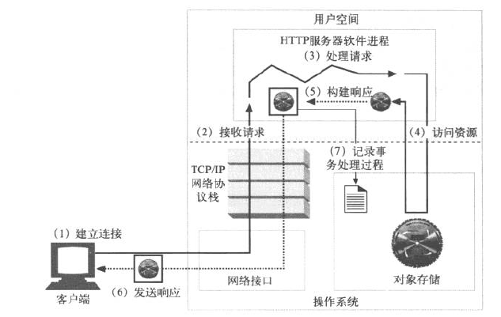

---

# HTTP
### HTTP简介：

HTTP（HyperText Transfer Protocol）即超文本传输协议，是一种详细规定了浏览器和万维网服务器之间互相通信的规则，它是万维网交换信息的基础，它允许将HTML（超文本标记语言）文档从Web服务器传送到Web浏览器。

HTTP协议目前最新版的版本是1.1，HTTP是一种无状态的协议，无状态是指Web浏览器与Web服务器之间不需要建立持久的连接，这意味着当一个客户端向服务器端发出请求，然后Web服务器返回响应（Response），连接就被关闭了，在服务器端不保留连接的有关信息。也就是说，HTTP请求只能由客户端发起，而服务器不能主动向客户端发送数据。

HTTP是一个基于TCP/IP通信协议来传递数据（HTML 文件, 图片文件, 查询结果等）。

### HTTP工作原理：
- HTTP协议工作于客户端-服务端架构上。浏览器作为HTTP客户端通过URL向HTTP服务端即WEB服务器发送所有请求。
- Web服务器有：Apache服务器，IIS服务器等
- Web服务器根据接收到的请求后，向客户端发送响应信息
- HTTP默认端口号80

### HTTP请求头和响应头
HTTP请求报文由3部门组成(请求行+请求头+请求体)


HTTP请求报文

请求方法（Request method）
- GET
- POST
- HEAD
- PUT

请求URL地址（统一资源定位符）

协议名称版本号

报文头（服务端获取客户端信息key：value）

报文体（a=1&b=2的键值对编码成一个格式字符串传递数值）

HTTP请求报文属性
- Accpet：高数服务器客户端接受什么类型的响应
- Referer：表示这个请求是从那个url进来的
- Cache-Control：对缓存进行控制
- Accept-Encoding：接收编码格式
- Host：指定要请求资源所在主机和端口
- User-Agent：浏览器版本信息

### HTTP响应报文
响应报文由三个部分组成（相应行，响应头，响应体）


- 报文协议及版本；

- 状态码及状态描述；

- 响应报文头，也是由多个属性组成；

- 响应报文体，即我们要的数据。

### HTTP状态码


- 200 OK 表示成功
- 303 重定向,把你重定向到其他页面
- 304 资源并未修改,可以直接使用本地的缓存
- 404 找不到页面(页面被删除或其他)
- 500 服务端错误

HTTP响应报文属性
- Cache-Control：响应输出到客户端后，服务器通过该属性告诉客户端该怎么控制响应内容的缓存
- ETag：表示你请求资源的版本，如果该资源发生变化，那么属性也会跟着变化
- Location：在重定向中或者创建新资源时使用
- Set-Cookie：服务端可以设置客户端cookie


### 一次完整的http请求过程

域名解析 --> 建立连接 --> 接受请求 --> 处理请求 --> 访问资源 --> 构建相应报文 --> 发送响应报文 --> 记录日志



- 域名解析：当用户在浏览器地址栏输入http://www.baidu.com 发起一个请求，首先会把该域名解析为ip地址。

    DNS 的详细解析过程：http://vinsent.blog.51cto.com/13116656/1967876

- 建立连接：浏览器会开启一个随机端口向服务器的80端口发起tcp连接请求，经过3次握手后建立tcp连接，然后向服务器发起httpd请求。   
  - TCP三次握手
  - TCP四次挥手

[](https://zhuanlan.zhihu.com/p/53374516)

- 接收请求：接受请求所要完成的工作就是接收来自网络的请求报文中对某一资源的请求过程
  - 单进程I/O模型
  - 多进程I/O模型
  - 复用I/O结构
  - 复用多线程I/O模型
- 处理请求：以Apache的prefork工作模式为例，管理进程在接受到请求报文后会选择一个工作进程来对该请求进行处理，得到其请求方法和资源URL等相关信息
- 访问资源：对请求处理时一般需要访问后端资源，执行代码得到请求结果，把结果返回给服务器
- 构建响应报文：在得到返回的请求结果后，开始构建响应报文
  - 永久重定向
  - 零时重定向
- 发送响应报文：响应报文构建完成后，发送响应报文
- 记录日志：最后，当事务结束时，web服务器会在日志文件中添加一个条目，来描述已执行的事务


### Cookie

Cookie，有时也用其复数形式 Cookies。类型为“小型文本文件”，是某些网站为了辨别用户身份，进行Session跟踪而储存在用户本地终端上的数据（通常经过加密），由用户客户端计算机暂时或永久保存的信息


1、Cookie是一种在客户端保持HTTP状态信息的技术

2、Cookie是在浏览器访问WEB服务器的某个资源时，由WEB服务器在HTTP响应消息头中附带发送给浏览器的数据

3、一旦WEB浏览器保存了某个Cookie，那么它在以后每次访问该WEB服务器时，都应在HTTP请求头中将这个Cookie发送给WEB服务器

#### Cookie功能特点：
- 存储于浏览器头部/传输于HTTP头部
- 写时带属性，读时无属性
- HTTP头中Cookie：user=admin;pwd=123;
- 属性name/value/expire/domain/path/.....
- 由三元组[name,doman,path]确定唯一cookie

#### Cookie的安全属性：
- secure属性：当设置为true时，表示创建的Cookie会被以安全的形式向服务器传输，也就是只能在HTTPS连接中被浏览器传递到服务器段进行会话验证，如果时HTTP连接则不会传递该信息，所以不能窃取到Cookie的具体内容。
- HttpOnly属性：如果在Cookie中设置了”HttpOnly“属性，那么通过程序（JS脚本等）将无法读取到Cookie信息，这样能有效防止XSS攻击。

 secure属性是防止信息在传递的过程中被监听捕获后信息泄露，HttpOnly属性的目的是防止程序获取cookie后进行攻击

### Session
Session 是 用于保持状态的基于Web服务器的方法。Session允许通过将对象存储在Web服务器的内存中在整个用户会话过程中保持任何对象


- 使用Cookie和附加URL参数都可以将上次请求的状态信息传递到下次请求中，但是如果传递的状态信息较多，将极大降低网络传输效率和增大服务器端程序处理的难度。

- Session是一种将会话状态保存在服务器端的技术。

- 客户端需要接收、记忆和发送Session的会话标识号，Session可以且通常是借助于Cookie来传递会话标识号。

#### 利用Cookie实现Session跟踪
- 如果web服务器处理某个访问请求时创建了新的HttpSession对象，它将会把会话标识号作为一个Cookie项加入到响应消息中，通常情况下，浏览器在随后发出的访问请求中又将会话标识号以Cookie的形式回传给web服务器。
- web服务器端程序依据回传的会话标识号就知道以前已经为该客户端创建了HttpSession对象，不必再为客户端创建新的HttpSession对象。而是直接使用与该会话标识号匹配的HttpSession对象，通过这种方式就实现了对同一个客户端的会话状态的跟踪。

### Cookie和Session


session和cookie同样都是针对单独用户对象，不同的用户在访问网站时，都会拥有各种的session或者cookie，不同用户之间互不干扰。
- 存储位置
- 生命周期

### cookie和session区别
- cookie数据存放在客户的浏览器，session数据存放在服务器。
- cookie不是很安全，可以分析存放在本地COOKIE并进行COOKIE欺骗考虑安全应当使用session。
- session会在一定时间内保存在服务器。当访问增多，会占用服务器性能。考虑减轻服务器性能方面，应当使用COOKIE。
- 单个cookie在客户端的限制时3k。


---


# 爬虫
网络爬虫（又称为网页蜘蛛，网络机器人，在FOAF社区中间，更经常的称为网页追逐者），是一种按照一定的规则，自动地抓取万维网信息的程序或者脚本。另外一些不常使用的名字还有蚂蚁、自动索引、模拟程序或者蠕虫。

## 爬虫分类
### 通用网络爬虫(Scalable Web Crawler)

通用网络爬虫的结构大致可以分为页面爬行模块、页面分析模块、链接过滤模块、页面数据库、URL 队列、初始 URL 集合

- 深度优先策略:按照深度又低到高的顺序，依次访问下一级网页链接，这种策略比较适合垂直搜索或站内搜索。
- 广度优先策略:按照网页内容目录层次深浅来爬行页面，处于较浅目录层次的页面首先被爬行。这种策略能够有效控制页面的爬行深度。

### 聚焦网络爬虫(Focused Crawler)

选择性爬行那些与预先定义好的主题相关页面的网络爬虫

- 基于内容评价的爬行策略：将用户输入查询词作为主题，包含查询词的页面被视为与主题相关，起局限性在于无法评价页面与主题相关度的高低。
- 基于链接结构评价的爬行策略：通过计算每个已访问页面的Authority权重和Hub权重，并依次决定链接的访问顺序。
- 基于增强学习的爬行策略：Rennie 和 McCallum 将增强学习引入聚焦爬虫，利用贝叶斯分类器，根据整个网页文本和链接文本对超链接进行分类，为每个链接计算出重要性，从而决定链接的访问顺序。
- 基于语境图的爬行策略：通过建立语境图学习网页之间的相似度，训练一个机器学习系统，通过该系统可计算当前页面到相关Web页面的距离，距离越近的页面中的链接优先访问。

### 增量式网络爬虫(Incremental Web Carawler)

指对已下载网页采取增量式更新和只爬行新产生的或者已经发生变化网页的爬虫，它能够在一定程度上保证所爬行的页面尽可能新的页面。

常用的方法有：
- 统一更新发
- 个体更新发
- 基于分类的更新法

### Deep Web爬虫(Surface Web)
Deep Web 是那些大部分内容不能通过静态链接获取的、隐藏在搜索表单后的，只有用户提交一些关键词才能获得的 Web 页面。

Deep Web 爬虫体系结构包含六个基本功能模块 （爬行控制器、解析器、表单分析器、表单处理器、响应分析器、LVS 控制器）和两个爬虫内部数据结构（URL 列表、LVS 表）。 其中 LVS（Label Value Set）表示标签/数值集合，用来表示填充表单的数据源。

Deep Web爬虫爬行过程中表单填写类型：
- 基于领域知识的表单填写
- 基于网页结构分析的表单填写

## 爬虫核心
- 爬取网页数据
- 解析数据
- 爬虫和反爬之间的博弈

## 爬虫用途
 - 数据分析/数据源
 - 社交软件冷启动
 - 竞争对手监控
 - 舆情监控


## 常见反爬手段
### 反爬的原因
   - 爬虫占总PV（PV是指页面的访问次数，没打开或刷新一次页面，就算一个PV）比较高，浪费资源。
   - 公司免费查询资源被批量爬取，丧失竞争力。
   - 法律的灰色地带，状告爬虫成功机率小。
   - 成型的商业对手

### 爬虫领域的概念
   - 爬虫：使用任何技术手段，批量获取网站信息的一种方式。
   - 反爬虫：使用任何技术手段，阻止别人批量获取自己网站信息的一种方式。
   - 误伤：在反爬虫的过程中，错误的将普通用户识别为爬虫。误伤率高的反爬虫策略，效果再好也不能用。
   - 拦截：成功地阻止爬虫访问。这里会有拦截率的概念。通常来说，拦截率越高的反爬虫策略，误伤的可能性就越高，因此需要做个权衡。
   - 资源：机器成本与人力成本的总和

### 反爬虫的三个方向
   - 基于身份识别进行反爬
   - 基于爬虫行为进行反爬
   - 基于数据加密进行反爬

### 常见基于身份识别进行反爬
请求参数的获取方法有很多，向服务器发送请求，很多时候需要携带请求参数，通常服务器端可以通过检查请求参数是否正确来判断是否为爬虫

#### 通过headers中User-Agent字段反爬 
- 反爬原理：爬虫默认情况下没有User-Agent，而是使用模块默认设置 
- 解决办法：请求之前添加User-Agent
  
#### 通过referer字段或其他字段发爬
- 反爬原理：爬虫默认情况不会带上referer字段，服务器端通过判断请求发起源头，判断请求是否合法 
- 解决办法：添加referer字段

#### 通过cookie反爬 
- 反爬原理：通过检查cookies来查看发起请求的用户是否具备响应权限，以此进行反爬
- 解决办法：进行模拟登录，成功获取cookies之后再进行数据爬取

#### 通过html静态文件中获取请求数据
- 反爬原理：通过增加获取请求参数的难度进行反爬 
- 解决办法：仔细分析抓包得到的每一个包，搞清楚请求之间的联系
  
#### 通过发送请求获取请求数据
- 反爬原理：通过增加获取请求参数的难度进行反爬
- 解决办法：仔细分析抓包得到的每一个包，搞清楚请求之间的联系，搞清楚请求参数的来源
  
#### 通过js生成请求参数
- 反爬原理：js生成了请求参数
- 解决办法：分析js、观察加密的实现过程，通过js2py获取js的执行结果，或者是selenium来实现
  
#### 通过验证码来反爬
- 反爬原理：对方服务器通过弹出验证码强制验证用户浏览行为
- 解决办法：打码平台或者机器学习的方法识别验证码

### 常见基于爬虫行为进行反爬

爬虫的行为与普通用户有着明显的区别，爬虫的请求频率与请求次数要远高于普通用户

#### 通过请求IP/账号单位时间内总请求数量进行反爬
- 反爬原理：正常浏览器请求网站，速度不会太快，同一个IP/账号大量请求了对方服务器，有更大的可能性会被识别为爬虫
- 解决办法：对应的通过购买高质量的IP的方式能够解决问题/购买多个账号

#### 通过同一IP/账号请求之间的时间间隔进行反爬
- 反爬原理：正常人操作浏览器浏览网站，请求之间的时间间隔是随机，而爬虫前后两个请求之间时间间隔通常比较固定，同时时间间隔较短，因此可以用来做反爬
- 解决办法：请求之间进行随机等待，模拟真实用户操作，在添加时间间隔后，为了能够高速获取数据，尽量使用代理池，如果是账号，则将账号请求之间设置随机休眠

#### 通过对请求IP/账号每天请求次数设置阈值进行反爬
- 反爬原理：正常的浏览行为，其一天的请求次数是有限的，通常超过某一个值，服务器就会拒绝响应
- 解决办法：对应的通过购买高质量的IP的方法/多账号，同时设置请求间随机休眠
  
#### 通过js实现跳转来反爬
- 反爬原理：js实现页面跳转，无法在源码中获取下一页url
- 解决办法：多次抓包获取条状url，分析规律

####  通过蜜罐（陷阱）获取爬虫IP（获取代理IP），进行反爬
- 反爬原理：在爬虫获取链接进行请求的过程中，爬虫会根据正则、xpath、css等方式进行后续链接的提取，此时服务器端可以设置一个陷阱url，会被提前规则获取，但是正常用户无法获取，这样就能有效的区分爬虫和正常用户
- 解决办法：完成爬虫的编写之后，使用代理批量爬取测试/仔细分析响应内容结构，找出页面中存在的陷阱

#### 通过假数据反爬
- 反爬原理：向返回的响应中添加假数据污染数据库，通常假数据不会被正常用户看到
- 解决办法：长期运行，核对数据库中数据同实际页面中数据对应情况，如果存在问题/仔细分析响应内容

#### 阻塞任务队列
- 反爬原理：通过生成大量垃圾url，从而阻塞任务队列，降低爬虫的实际工作效率
- 解决办法：观察运行过程中请求响应状态/仔细分析源码获取垃圾url生成规则，对URL进行过滤

#### 阻塞网络IO
- 反爬原理：发送请求获取响应的过程实际上就是下载的过程，在任务队列中混入一个大文件的url，当爬虫在进行该请求时将会占用网络IO，如果是有多线程则会占用线程
- 解决办法：观察爬虫运行状态/多线程对请求线程计时/发送请求线


#### 运维平台综合审计
- 反爬原理：通过运维平台进行综合管理，通常采用复合型反爬虫策略，多种手段同时使用
- 解决办法：仔细观察分析，长期运行测试目标网站，检查数据采集速度，多方面处理

### 常见基于数据加密进行反爬

对响应中含有的数据进行特殊化处理,通常的特殊化处理主要指的就是css数据偏移/自定义字体/数据加密/数据图片/特殊编码格式等

#### 通过自定义字体来反爬，例如猫眼电影的评分
- 反爬思路：使用自有字体文件
- 解决办法：切换到手机版/解析字体文件进行翻译

#### 通过css来反爬
- 反爬思路：源码数据不为真正的数据，需要通过css位移才能产生真正的数据
- 解决办法：计算css的偏移

#### 通过js动态生成数据进行反爬
- 反爬原理：通过js动态生成
- 解决办法：解析关键js，获得数据生成流程，模拟生成数据

#### 通过数据图片化反爬
- 反爬原理：58同城短租（https://baise.58.com/duanzu/3801871883498x.shtml）
- 解决办法：通过使用图片解析引擎从图片中解析数据

#### 通过编码格式进行反爬
- 反爬原理：不适用默认编码格式，在获取响应之后通常爬虫使用utf-8格式进行解码，此时解码结果将会是乱码或者报错
- 解决办法：根据源码进行多格式解码，或者真正的解码格式
  
### robots.txt协议
robots.txt(小写)是一种存放与根目录下的ASCCI编码的文本文件，它通常搞忘网络蜘蛛，此网站中的哪些内容是不应被网络蜘蛛爬取的，哪些是可以被网络蜘蛛爬取的。robots.txt协议并不是一个规范，而只是约定俗成的，所以并不能保证网站的隐私。

### Urllib

#### urllib库使用
```python
import urllib.request

# 1、定义url
url = 'http://www.baidu.com'
# 2、通过代码模拟浏览器向服务器发送请求
response = urllib.request.urlopen(url)
# 3、读取数据，一个字节一个字节的读取  read()方法返回的是字节形式的二进制，需要转换成utf-8
content = response.read().decode('utf-8')
```

#### 请求对象定制
```python
import urllib.request
import ssl
url = 'https://www.baidu.com'
headers = {
    'User-Agent':'Mozilla/5.0 (Macintosh; Intel Mac OS X 10_15_7) AppleWebKit/537.36 (KHTML, like Gecko) Chrome/93.0.4577.82 Safari/537.36'
}
request = urllib.request.Request(url=url,headers=headers)
response = urllib.request.urlopen(request,context=ssl.SSLContext())
content = response.read().decode('utf-8')
```

#### 编解码
- urllib.parse.quote()
```python
import urllib.request
import urllib.parse
import ssl

url = 'https://www.baidu.com/s?wd='
headers = {
    'User-Agent':'Mozilla/5.0 (Macintosh; Intel Mac OS X 10_15_7) AppleWebKit/537.36 (KHTML, like Gecko) Chrome/93.0.4577.82 Safari/537.36'
}
request_parameters ='张学友'
new_url = url+urllib.parse.quote(request_parameters)
request = urllib.request.Request(url=new_url,headers=headers)
response = urllib.request.urlopen(request,context=ssl.SSLContext())
content = response.read().decode('utf-8')
```

- urllib.parse.urlencode()
```python
import urllib.parse
import ssl

def get_webpage():
    url = 'https://www.baidu.com/s?'
    headers = {
        'User-Agent': 'Mozilla/5.0 (Macintosh; Intel Mac OS X 10_15_7) AppleWebKit/537.36 (KHTML, like Gecko) Chrome/93.0.4577.82 Safari/537.36'
    }
    data = {
        'wd':'张学友',
        'sex':'男',
        'location':'中国香港'
    }
    # 通过urlencode将参数进行unicode转码拼接
    new_url = url + urllib.parse.urlencode(data)
    # 请求对象的定制
    request = urllib.request.Request(url=new_url,headers=headers)
    response = urllib.request.urlopen(request,context=ssl.SSLContext())
    if response.getcode() == 200:
        content = response.read().decode('utf-8')
        with open('baidu.html','w') as f:
            f.write(content)
    else:
        print('Crawl failed ！')
```


#### ajax的get请求
```python
import urllib.request,urllib.parse,ssl

def get_ajax_doubantop20():
    url = 'https://movie.douban.com/j/chart/top_list?type=24&interval_id=100%3A90&action=&start=0&limit=20'
    headers = {
        'User-Agent': 'Mozilla/5.0 (Macintosh; Intel Mac OS X 10_15_7) AppleWebKit/537.36 (KHTML, like Gecko) Chrome/93.0.4577.82 Safari/537.36'
    }
    request = urllib.request.Request(url=url,headers=headers)
    response = urllib.request.urlopen(request,context=ssl.SSLContext())
    content = response.read().decode('utf-8')
    with open('doubantop20.json','w',encoding='utf-8') as f:
        f.write(content)
```

#### ajax的post请求
```python
import urllib.request,urllib.parse,ssl

def create_request(pageIndex):
    url = 'http://www.kfc.com.cn/kfccda/ashx/GetStoreList.ashx?op=cname'
    data = {
        'cname': '北京',
        'pid':'',
        'pageIndex': pageIndex,
        'pageSize': '10'
    }
    headers = {
        'User-Agent': 'Mozilla/5.0 (Macintosh; Intel Mac OS X 10_15_7) AppleWebKit/537.36 (KHTML, like Gecko) Chrome/93.0.4577.82 Safari/537.36'
    }
    new_data = urllib.parse.urlencode(data).encode('utf-8')
    return urllib.request.Request(url=url,data=new_data,headers=headers)

def get_content(request):
    response = urllib.request.urlopen(request,context=ssl.SSLContext())
    return response.read().decode('utf-8')

def download(page,content):
    with open('kfc_' + str(page) + '.json', 'w', encoding='utf-8') as f:
        f.write(content)
```


#### URLError HTTPError
- HTTPError类是URLError类的子类
- 导入urllib.error.HTTPError urllib.error.URLError
```python
import urllib.request,ssl,urllib.error

def get_cnsd_article():
    url = 'https://blosdas.csdn.net/sugar_no1/article/details/883179501'
    headers = {
        'User-Agent': 'Mozilla/5.0 (Macintosh; Intel Mac OS X 10_15_7) AppleWebKit/537.36 (KHTML, like Gecko) Chrome/93.0.4577.82 Safari/537.36'
    }
    request = urllib.request.Request(url=url,headers=headers)
    return urllib.request.urlopen(request,context=ssl.SSLContext())

if __name__ == '__main__':
    try:
        response = get_cnsd_article()
        content =response.read().decode('utf-8')
        print(content)
    except urllib.error.HTTPError:
        print('HTTPError!!!')
    except urllib.error.URLError:
        print('please check up url !')
```


#### cookie登录
```python
import urllib.request,ssl

def create_request():
    url = 'https://www.gulixueyuan.com/'
    headers = {
        'Cookie':'UM_distinctid=17937a0167455d-093b0867be2721-113a6054-13c680-17937a01675fdc; CNZZDATA1264603569=531034137-1620133818-null%7C1631791587; online-uuid=DCDFF27A-CFB5-2B26-5BB9-82FB28A78807; PHPSESSID=ftss7rtoujh5fevl4ccg8kpf57; REMEMBERME=Qml6XFVzZXJcQ3VycmVudFVzZXI6ZFhObGNsOW5ZVzlyT1RFeE1HUkFaV1IxYzI5b2J5NXVaWFE9OjE2NjMzMzY4MzY6MDIyNjUyMTYwZDRhZmM4Yzg3NTY1NjdlZmU4MDYyMTk1MmUwMzRmZTQ1ZDdkY2MyYWJlZmI3OTE5OGZlZGU5MA%3D%3D',
        'User-Agent': 'Mozilla/5.0 (Macintosh; Intel Mac OS X 10_15_7) AppleWebKit/537.36 (KHTML, like Gecko) Chrome/93.0.4577.82 Safari/537.36',
        'Referer': 'https://www.gulixueyuan.com/login'
    }
    return urllib.request.Request(url=url,headers=headers)

def get_content(request):
    return urllib.request.urlopen(request,context=ssl.SSLContext()).read().decode('utf-8')

def download(content):
    with open('sgg.html','w') as f:
        f.write(content)
```


#### Handler处理器
- 为什么要学习handler？
   - urllib.request.urlopen(url) 不能定制请求头
   - urllib.request.Request(url,headers,data)
   - Handler 可以定制更高级的请求头

#### 代理服务器（代理池）

- 代理的日常功能
  - 突破自身ip限制访问
  - 访问一些单位或团体内部资源
  - 提高访问速度
  - 隐藏真实ip
- 配置代理
  - 创建Request对象
  - 创建ProxyHandler对象
  - handler对象创建opener对象
  - opener.open发起请求

```python
import ssl,urllib.request,random

url = 'http://www.baidu.com/s?wd=ip'
headers = {
    'User-Agent': 'Mozilla/5.0 (Macintosh; Intel Mac OS X 10_15_7) AppleWebKit/537.36 (KHTML, like Gecko) Chrome/93.0.4577.82 Safari/537.36',
    'Referer':'https://www.baidu.com/s?ie=utf-8&f=8&rsv_bp=1&tn=baidu&wd=ip%E6%9F%A5%E8%AF%A2&oq=ip%25E6%259F%25A5%25E8%25AF%25A2&rsv_pq=93fa920200008ca9&rsv_t=e38bd2devLnU2pnYyuiCFdtzwh3I3gTa0RM85dJNYYIowWwE%2BMJwdn%2FecFA&rqlang=cn&rsv_dl=tb&rsv_enter=1&rsv_btype=t&inputT=5&rsv_sug3=9&rsv_sug1=3&rsv_sug7=100&rsv_sug2=0&rsv_sug4=721'
}
proxies_pool = [
    {'http':'58.243.29.180:4570'},
    {'http':'27.44.215.155:4513'},
    {'http':'58.243.29.58:4554'},
    {'http':'58.243.29.148:4570'},
]
request = urllib.request.Request(url=url,headers=headers)
handler = urllib.request.ProxyHandler(proxies=random.choice(proxies_pool))
opener = urllib.request.build_opener(handler)
response = opener.open(request)
content = response.read().decode('utf-8')
with open('ip_proxypool.html','w',encoding='utf-8') as f:
    f.write(content)
```

### 数据解析
#### xpath
- xpath插件安装（ctrl+shift+x）
- 安装lxml库（pip install lxml）
- 懒加载

##### xpath使用
 ```python
from lxml import etree

# etree.parse()读取本地HTMl
tree = etree.parse('07-xpath_test.html')

# 获取body/ul/li标签的内容
list_li = tree.xpath('body/ul/li/text()')

# 获取body/ul/li标签id为l1的内容
list_li = tree.xpath('//ul/li[@id="l1"]/text()')

# 获取body/ul/li标签有id属性的内容
list_li = tree.xpath('//ul/li[@id]/text()')

# 获取body/ul/li标签有class属性的内容
list_li = tree.xpath('//ul/li[@class]/text()')

# 获取body/ul/li标签有id和有class属性的内容
list_li = tree.xpath('//ul/li[@id and @class]/text()')

# 获取body/ul/li标签的id以l开头的内容
list_li = tree.xpath('//ul/li[starts-with(@id,"l")]/text()')

# 获取body/ul/li标签的id包含l的内容
list_li = tree.xpath('//ul/li[contains(@class,"c")]/text()')

# 获取body/ul/li标签id为l1的class属性值
attribute = tree.xpath('//ul/li[@id="l1"]/@class')
 ```
##### 抓取站长素材前10页图片
```python
import urllib.request
from lxml import etree

def create_request(page):
    url = None
    if page == 1:
        url = 'https://sc.chinaz.com/tupian/jinmaoquantupian.html'
    else:
        url = 'https://sc.chinaz.com/tupian/jinmaoquantupian_'+str(page)+'.html'
    headers = {
        'User-Agent': 'Mozilla/5.0 (Macintosh; Intel Mac OS X 10_15_7) AppleWebKit/537.36 (KHTML, like Gecko) Chrome/93.0.4577.82 Safari/537.36', 'Referer': 'https://www.baidu.com/s?ie=utf-8&f=8&rsv_bp=1&tn=baidu&wd=ip%E6%9F%A5%E8%AF%A2&oq=ip%25E6%259F%25A5%25E8%25AF%25A2&rsv_pq=93fa920200008ca9&rsv_t=e38bd2devLnU2pnYyuiCFdtzwh3I3gTa0RM85dJNYYIowWwE%2BMJwdn%2FecFA&rqlang=cn&rsv_dl=tb&rsv_enter=1&rsv_btype=t&inputT=5&rsv_sug3=9&rsv_sug1=3&rsv_sug7=100&rsv_sug2=0&rsv_sug4=721'
    }
    return urllib.request.Request(url=url,headers=headers)

def get_content(request):
    response = urllib.request.urlopen(request)
    return response.read().decode('utf-8')

def download(content):
    tree = etree.HTML(content)
    img_url = tree.xpath('//div[@id="container"]//a/img/@src2')
    name = tree.xpath('//div[@id="container"]//a/img/@alt')
    for i in range(len(img_url)):
        url = 'https:'+img_url[i]
        filename = './download_pricture/'+name[i]+'.jpg'
        urllib.request.urlretrieve(filename=filename,url=url)
```

#### JsonPath
- pip install jsonpath
##### JsonPath使用
 ```python
import json,jsonpath

object = json.load(open('08-crawler_jsonpath.json','r',encoding='utf-8'))

# 获取所有书的作者
author_list = jsonpath.jsonpath(object,'$.store.book[*].author')
print(author_list)

# 所有的作者
author_list = jsonpath.jsonpath(object,'$..author')
print(author_list)

# store下面的所有元素
tag_list = jsonpath.jsonpath(object,'$.store.*')
print(tag_list)

# store里面所有东西的price
price = jsonpath.jsonpath(object,'$.store..price')
print(price)

# 第三本书
book = jsonpath.jsonpath(object,'$..book[2]')
print(book)

# 最后一本书
book = jsonpath.jsonpath(object,'$..book[(@.length-1)]')
print(book)

# 前面两本书
book_list = jsonpath.jsonpath(object,'$..book[:2]')
book_list = jsonpath.jsonpath(object,'$..book[0,1]')
print(book_list)

# 过滤出所有包含isbn的书
book_list = jsonpath.jsonpath(object,'$..book[?(@.isbn)]')
print(book_list)

# 哪本书价格超过了10快
book_list = jsonpath.jsonpath(object,'$..book[?(@.price>10)]')
print(book_list)
 ```

##### 淘票票城市数据
```python
import urllib.request,json,jsonpath

def create_request():
    url = 'https://dianying.taobao.com/cityAction.json?activityId&_ksTS=1632662735620_134&jsoncallback=jsonp135&action=cityAction&n_s=new&event_submit_doGetAllRegion=true'
    headers = {
        'accept': 'text/javascript, application/javascript, application/ecmascript, application/x-ecmascript, */*; q=0.01',
        'accept-language': 'zh-CN,zh;q=0.9',
        'cookie': 'cna=foyqGW1EDTICAWXMQt+mnIzQ; t=d8799591d39e8a91536ef1af53e94680; lgc=%5Cu738B%5Cu5FD7%5Cu5F3A18228660970; tracknick=%5Cu738B%5Cu5FD7%5Cu5F3A18228660970; hng=CN%7Czh-CN%7CCNY%7C156; thw=cn; enc=xaQAAf1k3RE0T6wwZbGLyV2Gnja1k0Qb1sUIKvldK8cqhNB0yJdteQDn5wniaVkO%2BkLgHMdFymW9XvMw4QJgvQ%3D%3D; uc3=nk2=rpB9i5t4xCwUCLbHex6iP5Y%3D&id2=UUGrdCbqdCCNpQ%3D%3D&lg2=W5iHLLyFOGW7aA%3D%3D&vt3=F8dCujC5mqqlWnWtiF8%3D; uc4=nk4=0%40rMpFul3%2BHjvKbCkx325MJ6j9eKMThOpH7W4geA%3D%3D&id4=0%40U2OcRLKI%2FEgm9OyPQArEW1A%2BZQRT; _cc_=WqG3DMC9EA%3D%3D; xlly_s=1; cookie2=1bf16ed34adc72f369feffb4b59fd887; v=0; _tb_token_=56d8f63eb53e9; mt=ci=-1_0; tb_city=513200; tb_cityName="sKKw0w=="; uc1=cookie14=Uoe3dYeFqc%2FGog%3D%3D; tfstk=c11dBvG4Slq31D8Ou9egPdCe0dfRZGhH4z-SwPINyFcKVMlRiS5cM1ltUUmp6PC..; l=eBrCbbwugrzv13B8BO5CFurza779mQAb4sPzaNbMiInca69h1F11FNCLH0F2RdtjgtCAaetrd8LeqRLHR3AgCc0c07kqm0RxexvO.; isg=BFVVhJkpmMQ3ebzFQpH_cJvAZFEPUglks08wbNf4EkwbLnUgn6LDNDLg-DKYLiEc',
        'referer': 'https://dianying.taobao.com/',
        'sec-ch-ua': '"Google Chrome";v="93", " Not;A Brand";v="99", "Chromium";v="93"',
        'sec-ch-ua-mobile': '?0',
        'sec-ch-ua-platform': '"Windows"',
        'sec-fetch-dest': 'empty',
        'sec-fetch-mode': 'cors',
        'sec-fetch-site': 'same-origin',
        'user-agent': 'Mozilla/5.0 (Windows NT 10.0; Win64; x64) AppleWebKit/537.36 (KHTML, like Gecko) Chrome/93.0.4577.82 Safari/537.36',
        'x-requested-with': 'XMLHttpRequest',
    }
    return urllib.request.Request(url=url,headers=headers)

def get_content(request):
    response = urllib.request.urlopen(request)
    return response.read().decode('utf-8')
```

#### BeautifulSoup（bs4）
- pip install bs4

##### bs4使用
 ```python
from bs4 import BeautifulSoup

# 通过bs4解析本地文件,默认读取文件方式为gbk,所以需要指定utf-8编码
soup = BeautifulSoup(open('09-crawler_bs4.html','r',encoding='utf-8'),'lxml')

# 根据标签名查找到第一个符合条件的数据
print(soup.a)

# 获取标签的属性和属性值
print(soup.a.attrs)

# bs4的一些函数
# (1) find
# 返回的是第一个符合条件的数据
print(soup.find('li'))

# 根据title的值来找到对应的标签
print(soup.find('a',title='a2'))

# 根据class属性值来找到对应的标签,class语法已经纯在所以需要添加_
print(soup.find('p',class_='p1'))

# (2)find_all 返回所有匹配的标签list
print(soup.findAll('li'))

# 查找多个标签
print(soup.findAll(['a','span']))

# limit的作用是查找的前几个数据
print(soup.findAll('li',limit=2))

# (3) select
# select查询返回一个list
print(soup.select('li'))

# 通过类选择器
# 查找class属性为a1的标签
print(soup.select('.a1'))
print(soup.select('#l2'))

# 属性选择器
# 查找li标签中id=l2的标签
print(soup.select('li[id="l2"]'))

# 查找li标签中有id的标签
print(soup.select('li[id]'))

# 层级选择器
# 后代选择器
# 找到div下面的li
print(soup.select('div li'))

# 子代选择器:某标签的第一级标签
print(soup.select('div > ul > span'))

# 找到a标签和li标签的所有对象
print(soup.select('a,li'))

# 节点信息
tag_l1 = soup.select('#l1')[0]
print(tag_l1)

# 获取标签内容
print(tag_l1.get_text())

# 获取标签对象中，存在标签那么string就获取不到数据，使用get_text()就能获取数据
print(tag_l1.string)

# 节点属性
tag_obj = soup.select('#p1')[0]
print(tag_obj.name)
print(tag_obj.attrs)soup = BeautifulSoup(response.read().decode(),'lxml')
 ```

##### 爬去星巴克菜单图片数据
```python
import urllib.request,json
from bs4 import BeautifulSoup

def down_load(menu_name_list,picture_url_list):
    for i in range(len(menu_name_list)):
        file_name = './starbucks_menu_picture/'+menu_name_list[i].get_text()+'.jpg'
        picture_url = 'https://www.starbucks.com.cn'+menu_picture_list[i].get('style').split('"')[1].split('"')[0]
        try:
            urllib.request.urlretrieve(picture_url,file_name)
        except FileNotFoundError:
            name = menu_name_list[i].get_text().replace('/',' ')
            file_name = './starbucks_menu_picture/'+name+'.jpg'
            urllib.request.urlretrieve(picture_url, file_name)

if __name__ == '__main__':
    url = 'https://www.starbucks.com.cn/menu/'
    response = urllib.request.urlopen(url=url)
    content = response.read().decode('utf-8')
    soup = BeautifulSoup(content, 'lxml')
    menu_name_list = soup.select('ul[class="grid padded-3 product"] strong')
    menu_picture_list = soup.select('div[class="preview circle"]')
    down_load(menu_name_list,menu_picture_list)
```


### selenium

#### 什么是selenium？
- Selenium是一个用于Web应用程序测试的工具
- Selenium测试直接运行在浏览器中，模拟用户真实操作浏览器
- 支持各种driver（FirfoxDriver,IternetExplorerDriver,ChromeDriver等）驱动
- selenium支持无界面浏览器操作

#### 为什么使用selenium？

模拟浏览器功能，自动执行网页中的js代码，实现动态加载

#### 安装selenium
- ChromeDriver（http://chromedriver.storage.googleapis.com/index.html）
- pip install selenium

#### selenium使用步骤
```python
from selenium import webdriver

path = 'chromedriver.exe'
browser = webdriver.Chrome(path)
browser.get("https://www.baidu.com/")

# 通过id定位元素
button = browser.find_element_by_id("su")
print(button)

# 通过name定位元素
name = browser.find_elements_by_name("wd")
print(name)

# 通过xpath语发定位元素
img_xpath =  browser.find_elements_by_xpath("//div[@id='wrapper']//input")
print(img_xpath)

# 通过标签名定位元素
tag_name = browser.find_elements_by_tag_name('input')
print(tag_name)

# 通过css属性定位元素
css_selector = browser.find_elements_by_css_selector('#kw')
print(css_selector)

# 通过超链接文本定位
link_text = browser.find_element_by_link_text('贴吧')
print(link_text)

# 获取元素文本
print(link_text.text)

# 获取元素属性
print(link_text.get_attribute('class'))

# 获取标签名
print(link_text.tag_name)
# 关闭浏览器
browser.quit()
```

### Phantomjs
- 无界面浏览器
- 支持页面元素查找，js代码运行
- 由于不进行css和gui渲染，运行效率高
```python
from selenium import webdriver

browser = webdriver.PhantomJS('phantomjs.exe')
browser.get('https://www.baidu.com/')
# 保存屏幕快照
browser.save_screenshot('baidu.png')
browser.find_element_by_id('kw').send_keys('刘德华')
browser.find_element_by_id('su').click()
browser.save_screenshot('刘德华.png')
browser.quit()
```

### Chrome handless
- chrome-headless模式
```python
from selenium import webdriver
from selenium.webdriver.chrome.options import Options

def share_browser():
    chrome_options = Options()
    chrome_options.add_argument('‐‐headless')
    chrome_options.add_argument('‐‐disable‐gpu')
    path = r"C:\Program Files\Google\Chrome\Application\chrome.exe"
    chrome_options.binary_location = path
    return webdriver.Chrome(chrome_options=chrome_options)

browser = share_browser()
browser.get('https://www.baidu.com/')
```


