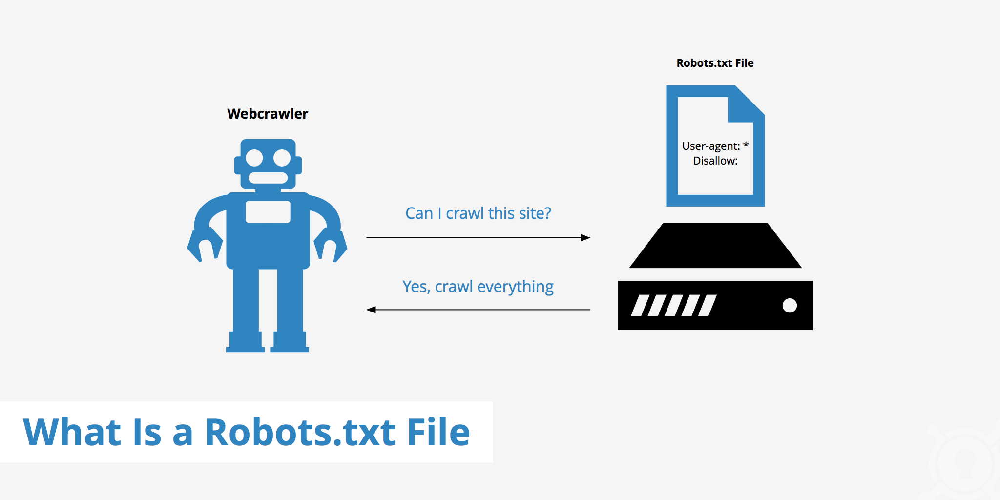

# 常见反爬手段

## 反爬的原因

   - 爬虫占总PV（PV是指页面的访问次数，没打开或刷新一次页面，就算一个PV）比较高，浪费资源。
   - 公司免费查询资源被批量爬取，丧失竞争力。
   - 法律的灰色地带，状告爬虫成功机率小。
   - 成型的商业对手

## 爬虫领域的概念

   - 爬虫：使用任何技术手段，批量获取网站信息的一种方式。
   - 反爬虫：使用任何技术手段，阻止别人批量获取自己网站信息的一种方式。
   - 误伤：在反爬虫的过程中，错误的将普通用户识别为爬虫。误伤率高的反爬虫策略，效果再好也不能用。
   - 拦截：成功地阻止爬虫访问。这里会有拦截率的概念。通常来说，拦截率越高的反爬虫策略，误伤的可能性就越高，因此需要做个权衡。
   - 资源：机器成本与人力成本的总和

## 反爬虫的三个方向

   - 基于身份识别进行反爬
   - 基于爬虫行为进行反爬
   - 基于数据加密进行反爬

### 常见基于身份识别进行反爬

请求参数的获取方法有很多，向服务器发送请求，很多时候需要携带请求参数，通常服务器端可以通过检查请求参数是否正确来判断是否为爬虫

#### 通过headers中User-Agent字段反爬 

- 反爬原理：爬虫默认情况下没有User-Agent，而是使用模块默认设置 
- 解决办法：请求之前添加User-Agent

#### 通过referer字段或其他字段发爬

- 反爬原理：爬虫默认情况不会带上referer字段，服务器端通过判断请求发起源头，判断请求是否合法 
- 解决办法：添加referer字段

#### 通过cookie反爬 

- 反爬原理：通过检查cookies来查看发起请求的用户是否具备响应权限，以此进行反爬
- 解决办法：进行模拟登录，成功获取cookies之后再进行数据爬取

#### 通过html静态文件中获取请求数据

- 反爬原理：通过增加获取请求参数的难度进行反爬 
- 解决办法：仔细分析抓包得到的每一个包，搞清楚请求之间的联系

#### 通过发送请求获取请求数据

- 反爬原理：通过增加获取请求参数的难度进行反爬
- 解决办法：仔细分析抓包得到的每一个包，搞清楚请求之间的联系，搞清楚请求参数的来源

#### 通过js生成请求参数

- 反爬原理：js生成了请求参数
- 解决办法：分析js、观察加密的实现过程，通过js2py获取js的执行结果，或者是selenium来实现

#### 通过验证码来反爬

- 反爬原理：对方服务器通过弹出验证码强制验证用户浏览行为
- 解决办法：打码平台或者机器学习的方法识别验证码

### 常见基于爬虫行为进行反爬

爬虫的行为与普通用户有着明显的区别，爬虫的请求频率与请求次数要远高于普通用户

#### 通过请求IP/账号单位时间内总请求数量进行反爬

- 反爬原理：正常浏览器请求网站，速度不会太快，同一个IP/账号大量请求了对方服务器，有更大的可能性会被识别为爬虫
- 解决办法：对应的通过购买高质量的IP的方式能够解决问题/购买多个账号

#### 通过同一IP/账号请求之间的时间间隔进行反爬

- 反爬原理：正常人操作浏览器浏览网站，请求之间的时间间隔是随机，而爬虫前后两个请求之间时间间隔通常比较固定，同时时间间隔较短，因此可以用来做反爬
- 解决办法：请求之间进行随机等待，模拟真实用户操作，在添加时间间隔后，为了能够高速获取数据，尽量使用代理池，如果是账号，则将账号请求之间设置随机休眠

#### 通过对请求IP/账号每天请求次数设置阈值进行反爬

- 反爬原理：正常的浏览行为，其一天的请求次数是有限的，通常超过某一个值，服务器就会拒绝响应
- 解决办法：对应的通过购买高质量的IP的方法/多账号，同时设置请求间随机休眠

#### 通过js实现跳转来反爬

- 反爬原理：js实现页面跳转，无法在源码中获取下一页url
- 解决办法：多次抓包获取条状url，分析规律

####  通过蜜罐（陷阱）获取爬虫IP（获取代理IP），进行反爬

- 反爬原理：在爬虫获取链接进行请求的过程中，爬虫会根据正则、xpath、css等方式进行后续链接的提取，此时服务器端可以设置一个陷阱url，会被提前规则获取，但是正常用户无法获取，这样就能有效的区分爬虫和正常用户
- 解决办法：完成爬虫的编写之后，使用代理批量爬取测试/仔细分析响应内容结构，找出页面中存在的陷阱

#### 通过假数据反爬

- 反爬原理：向返回的响应中添加假数据污染数据库，通常假数据不会被正常用户看到
- 解决办法：长期运行，核对数据库中数据同实际页面中数据对应情况，如果存在问题/仔细分析响应内容

#### 阻塞任务队列

- 反爬原理：通过生成大量垃圾url，从而阻塞任务队列，降低爬虫的实际工作效率
- 解决办法：观察运行过程中请求响应状态/仔细分析源码获取垃圾url生成规则，对URL进行过滤

#### 阻塞网络IO

- 反爬原理：发送请求获取响应的过程实际上就是下载的过程，在任务队列中混入一个大文件的url，当爬虫在进行该请求时将会占用网络IO，如果是有多线程则会占用线程
- 解决办法：观察爬虫运行状态/多线程对请求线程计时/发送请求线

#### 运维平台综合审计

- 反爬原理：通过运维平台进行综合管理，通常采用复合型反爬虫策略，多种手段同时使用
- 解决办法：仔细观察分析，长期运行测试目标网站，检查数据采集速度，多方面处理

### 常见基于数据加密进行反爬

对响应中含有的数据进行特殊化处理,通常的特殊化处理主要指的就是css数据偏移/自定义字体/数据加密/数据图片/特殊编码格式等

#### 通过自定义字体来反爬，例如猫眼电影的评分

- 反爬思路：使用自有字体文件
- 解决办法：切换到手机版/解析字体文件进行翻译

#### 通过css来反爬

- 反爬思路：源码数据不为真正的数据，需要通过css位移才能产生真正的数据
- 解决办法：计算css的偏移

#### 通过js动态生成数据进行反爬

- 反爬原理：通过js动态生成
- 解决办法：解析关键js，获得数据生成流程，模拟生成数据

#### 通过数据图片化反爬

- 反爬原理：[58同城短租](https://baise.58.com/duanzu/3801871883498x.shtml)
- 解决办法：通过使用图片解析引擎从图片中解析数据

#### 通过编码格式进行反爬

- 反爬原理：不适用默认编码格式，在获取响应之后通常爬虫使用utf-8格式进行解码，此时解码结果将会是乱码或者报错
- 解决办法：根据源码进行多格式解码，或者真正的解码格式

### robots.txt协议

robots.txt(小写)是一种存放与根目录下的ASCCI编码的文本文件，它通常搞忘网络蜘蛛，此网站中的**哪些内容是不应被网络蜘蛛爬取的，哪些是可以被网络蜘蛛爬取的。

   

       robots.txt协议并不是一个规范，而只是约定俗成的,所以并不能保证网站的隐私。
    
 

 
